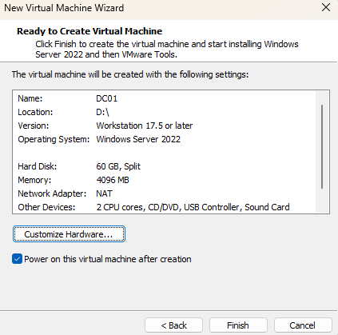
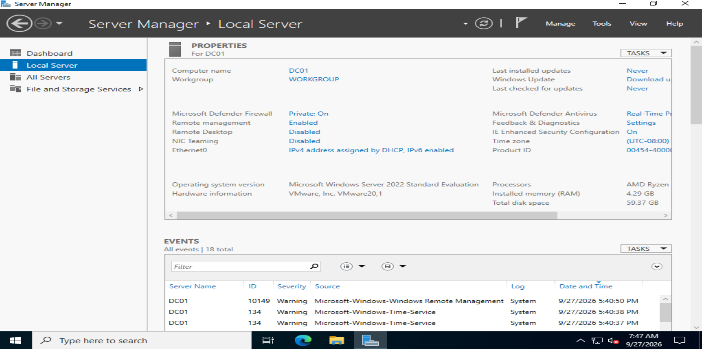
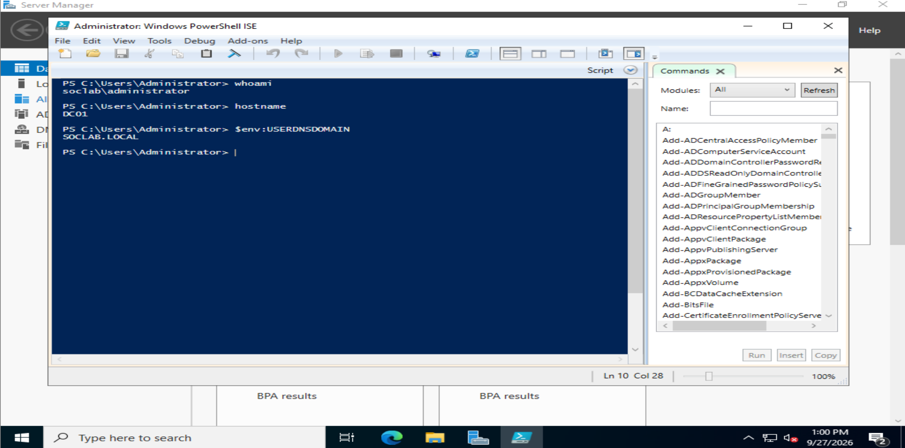
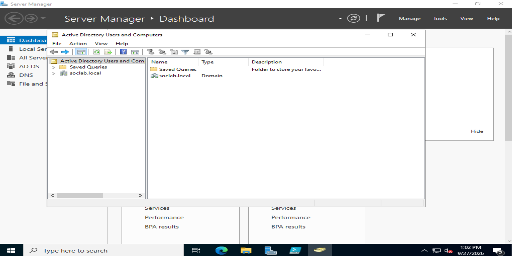

# 02 - Windows Server Domain Controller Deployment

## Objective

The second phase of the SOC home lab establishes the Windows enterprise identity infrastructure.

A Windows Server 2022 virtual machine was deployed on the desktop system and configured as the first domain controller in the lab.

The server provides:

- Active Directory Domain Services
- DNS
- Domain authentication
- Centralized identity management

The Active Directory domain created for the lab is:

```text
soclab.local
```

---

## Host System

The domain controller is hosted on the desktop system.

- CPU: AMD Ryzen 5 7600
- RAM: 32 GB
- Host OS: Windows
- Hypervisor: VMware Workstation Pro

---

## Virtual Machine Creation

A new VMware virtual machine named `DC01` was created for Windows Server 2022.

The virtual machine was configured with:

- Operating System: Windows Server 2022 Standard Evaluation
- RAM: 4 GB
- vCPU: 2
- Disk: 60 GB
- Network Mode: NAT



The Windows Server installation ISO was mounted manually and Windows Server 2022 Standard Evaluation with Desktop Experience was installed.

---

## Server Configuration

After Windows Server installation, the machine was renamed to:

```text
DC01
```

Server Manager was used to verify the hostname and basic server configuration.



At this stage, the server was still operating as a standalone Windows Server system before being promoted to a domain controller.

---

## Active Directory Domain Services

The following Windows Server roles were installed:

- Active Directory Domain Services
- DNS Server

The server was then promoted to a domain controller.

A new Active Directory forest was created with the root domain:

```text
soclab.local
```

`DC01` became the first domain controller for the new forest.

---

## Domain Validation

After promotion and reboot, the Active Directory environment was validated using PowerShell.

The following commands were executed:

```powershell
whoami
hostname
$env:USERDNSDOMAIN
```

The output confirmed:

```text
User: soclab\administrator
Hostname: DC01
Domain: SOCLAB.LOCAL
```



This confirms that the server is operating as a domain controller within the `soclab.local` domain.

---

## Active Directory Validation

Active Directory Users and Computers was opened to confirm that the domain was successfully created.

The console displayed:

```text
soclab.local
```

as the Active Directory domain.



The domain is now ready to contain users, computers, organizational units, and other enterprise objects.

---

## Current Architecture

At this stage, the desktop side of the lab contains the first enterprise infrastructure server:

```text
Desktop
|
+-- Windows Host
    |
    +-- VMware Workstation Pro
        |
        +-- DC01
            |
            +-- Windows Server 2022
            +-- Active Directory Domain Services
            +-- DNS Server
            +-- Domain: soclab.local
```

The SOC infrastructure remains hosted on the laptop:

```text
Laptop
|
+-- Windows Host
    |
    +-- VMware Workstation Pro
        |
        +-- SOC-WAZUH01
            |
            +-- Ubuntu Server 24.04 LTS
            +-- Wazuh Manager
            +-- Wazuh Indexer
            +-- Wazuh Dashboard
```

---

## Role of DC01 in the Lab

`DC01` will act as the identity infrastructure for the simulated enterprise environment.

It will be used to generate and monitor security events related to:

- User authentication
- Failed login attempts
- Account creation
- Account deletion
- Password changes
- Group membership changes
- Privileged account activity
- Kerberos authentication
- Domain-joined endpoint activity

These events will later be forwarded to the SOC infrastructure for detection and investigation.

---

## Result

A functional Windows Server 2022 domain controller was successfully deployed.

The following components are operational:

- Windows Server 2022
- Hostname `DC01`
- Active Directory Domain Services
- DNS Server
- Active Directory forest
- `soclab.local` domain

The environment is now ready for domain users, organizational units, and Windows endpoints.

---

## Next Steps

- Create Active Directory organizational units
- Create lab users and groups
- Deploy `WIN11-01`
- Join `WIN11-01` to `soclab.local`
- Configure Windows auditing
- Install Sysmon
- Install the Wazuh agent
- Connect the desktop environment to `SOC-WAZUH01`
- Begin forwarding Windows security telemetry
